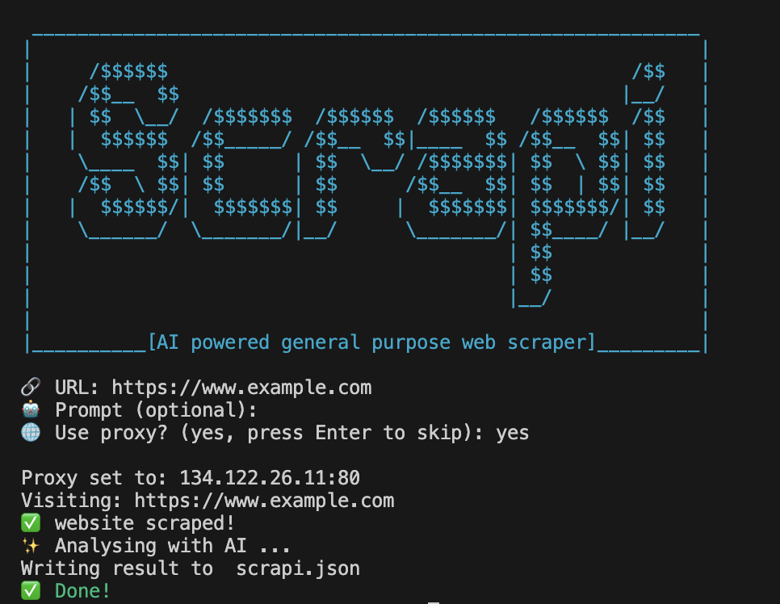

# Scrapi
AI powered general purpose web scraper



This is a command-line interface (CLI) tool built in Go that scrapes content from a specified webpage and interacts with OpenAI's API to generate summaries or other insights based on the scraped data. The tool prompts the user for the following inputs:

- URL: The webpage URL to scrape content from.
- Optional Prompt: A custom prompt to send along with the scraped content to OpenAI. If left blank, a default prompt is used to summarize the scraped content.
- Proxy Usage: An option to use a proxy for scraping. If enabled, the tool fetches and sets a proxy automatically to mask the scraping requests.

## Run Scrapi

Add the following to `.env `

```
OPENAI_API_KEY = "your-api-key"
```

Run 
```
./scraper 
```